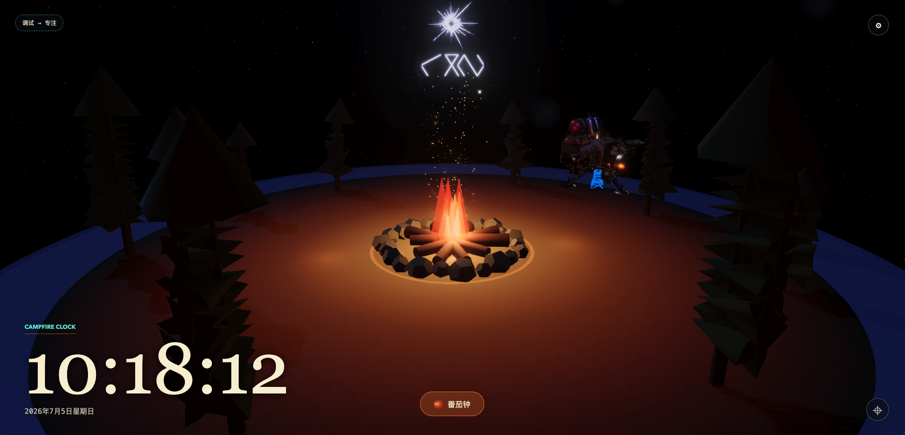
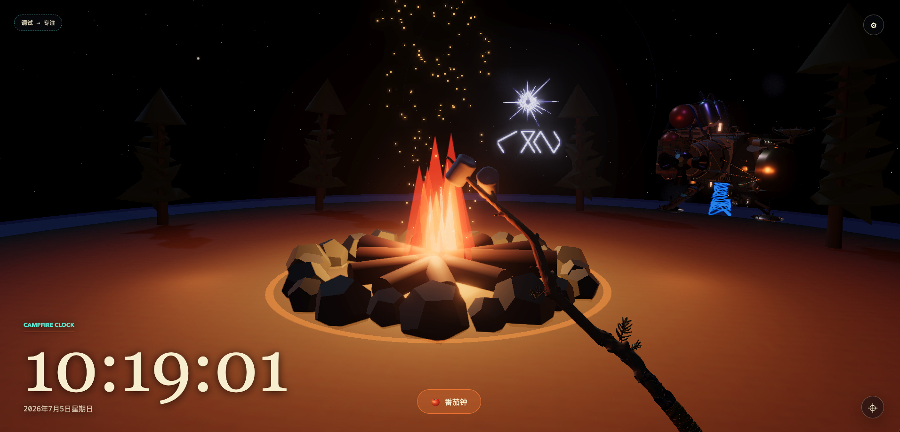
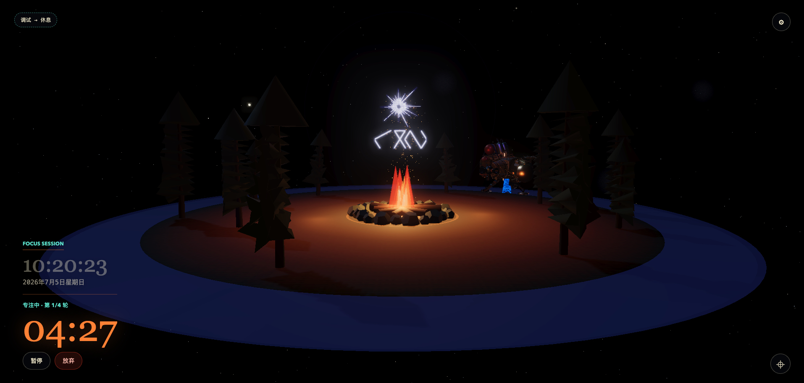

# 木炉星篝火 new tab

Outer Wilds 风格 3D 篝火新标签页 Chrome 扩展，内置可选功能模块、经典番茄钟（专注 -> 烤棉花糖 -> 休息）、今日 TODO、快捷导航与稍后再看，配有专注白噪音、提示音、休息背景音乐与沉浸式星空篝火场景。

[](https://github.com/KateLiao/Outer-Wilds-themed-new-tab/actions/workflows/pages.yml)
[](https://github.com/KateLiao/Outer-Wilds-themed-new-tab/actions/workflows/release.yml)





## 一键预览

打开在线演示页即可先看效果：

[Live Demo](https://kateliao.github.io/Outer-Wilds-themed-new-tab/)

> 在线演示页会使用 `localStorage` 保存设置。Chrome 扩展安装后会改用 `chrome.storage`，并启用后台计时与浏览器通知。

## 安装为 Chrome 扩展

Chrome 出于安全限制，不允许从 GitHub 直接“一键安装”未上架扩展。这个项目提供自动打包好的 ZIP，下载后只需加载一次解压目录。

1. 打开 [Releases](https://github.com/KateLiao/Outer-Wilds-themed-new-tab/releases)
2. 下载最新版 `outer-wilds-new-tab.zip`
3. 解压 ZIP 到本地任意目录
4. 打开 Chrome 的 `chrome://extensions`
5. 开启右上角「开发者模式」
6. 点击「加载已解压的扩展程序」，选择刚解压的目录
7. 打开新标签页即可使用

如果 Release 页面暂时没有 ZIP，也可以按下面的开发者安装方式本地打包。

## 开发者安装

```bash
npm install
npm run pack:extension
```

执行后会生成：

```text
release/outer-wilds-new-tab.zip
```

你也可以直接加载项目根目录：

```bash
npm install
npm run build
```

然后在 `chrome://extensions` 中选择本项目根目录作为「已解压的扩展程序」。

## 本地预览

```bash
npm install
npm run build
npm start
```

| 页面 | 用途 |
|------|------|
| `http://localhost:6287/newtab.html` | 与扩展新标签页一致的完整体验（推荐） |
| `http://localhost:6287/index.html` | 同 UI 的备用入口 |

本地开发时 `chrome.storage` 会降级为 `localStorage`，后台计时与浏览器通知不可用，番茄钟核心流程仍可测试。

## 功能截图



## 常用命令

| 命令 | 说明 |
|------|------|
| `npm run build` | 将 `app.js` 及 Three.js 依赖打包为 `dist/app.bundle.js` |
| `npm run check` | 检查全部运行时代码语法并完成生产构建 |
| `npm run pack:extension` | 构建并生成可上传 Release / 可本地安装的扩展 ZIP |
| `npm start` | 启动本地静态预览服务 |

修改 `app.js`、`outer-wilds-vfx.js` 或 `vfx-shaders.js` 后，请重新执行 `npm run build`，再在 Chrome 扩展页点击「重新加载」。

## 自动部署与发布

这个仓库已经内置 GitHub Actions：

| 工作流 | 触发方式 | 产物 |
|--------|----------|------|
| `Deploy demo` | 推送到 `main` / `master` 或手动运行 | 部署在线演示页到 GitHub Pages |
| `Package extension` | 推送 `v*` tag 或手动运行 | 生成 `outer-wilds-new-tab.zip` |

第一次使用 GitHub Pages 时，请在仓库 `Settings -> Pages` 中将 Source 设为 `GitHub Actions`。

发布 V1.2 示例：

```bash
git tag v1.2.0
git push origin v1.2.0
```

推送 tag 后，`Package extension` 会自动构建 ZIP 并创建 GitHub Release。

## 功能摘要

- 可选功能模块：SVG 启动坞默认启用番茄钟、今日 TODO、快捷导航与稍后再看，设置中可开关模块
- 设置工作台：右上角齿轮打开右侧全高设置面板，分区管理模块、快捷导航与番茄钟参数
- 右侧观测舱面板：hover 预览、click 常驻；面板打开时 canvas 仍全屏，3D 相机轻微平移让构图向左让位
- 今日 TODO：支持快速添加、完成/取消完成、编辑标题、删除、清空已完成；长标题自动换行，且不会按日期自动删除或隐藏
- 快捷导航：设置中添加常用网站，可通过拖动柄调整位置；自动推导 favicon 并在导航面板中生成圆形图标，失败时使用首字兜底
- 稍后再看：工具栏一键保存网页，支持文章/视频分类、消费状态、拖动归类、批量管理与删除撤销
- 经典番茄钟：默认 25 / 5 / 15 分钟，4 轮一长休息，参数可在设置中调整
- 独立音频控制：静音按钮控制专注白噪音与休息音乐，不影响阶段提示音
- 场景联动：专注时弱化时钟、增强篝火动效；专注完成立即进入烤棉花糖近景并同时开始休息
- 音频：专注时播放篝火白噪音，专注开始 ding、休息开始 pop；短/长休息循环播放 Timber Hearth 背景音乐
- 后台可靠：关闭标签后由 Service Worker 继续计时；标签在后台时推送浏览器通知
- 确认交互：放弃专注、跳过休息使用统一弹窗，替代浏览器原生 `confirm`
- 可选手动烤火：Idle 状态下双击场景可进入烤棉花糖视角（设置中可关闭）
- 调试：左上角按钮可快速切换「专注中 <-> 短休息」（开发调试用）

## 项目结构

| 文件 / 目录 | 说明 |
|-------------|------|
| `manifest.json` | Chrome MV3 扩展配置 |
| `newtab.html` | 新标签页入口 |
| `newtab-main.js` | 应用入口，串联番茄钟与 3D 场景 |
| `feature-settings.js` | 功能模块注册表与模块开关设置 |
| `todo.js` | 今日 TODO 数据控制器 |
| `quick-links.js` | 快捷导航数据控制器与 favicon 推导 |
| `read-later.js` | 稍后再看数据、分类、状态与排序控制器 |
| `pomodoro.js` | 番茄钟状态机与轮次规则 |
| `pomodoro-ui.js` | HUD、SVG 启动坞、右侧观测舱面板、设置工作台、TODO 与快捷导航 UI |
| `confirm-dialog.js` | 统一风格确认弹窗（放弃专注、跳过休息） |
| `audio.js` | 专注白噪音、阶段提示音与休息背景音乐 |
| `storage-adapter.js` | `chrome.storage` / `localStorage` 适配 |
| `background.js` | Service Worker：后台计时与通知 |
| `app.js` | Three.js 篝火场景（Rollup 打包入口） |
| `outer-wilds-vfx.js` / `vfx-shaders.js` | Outer Wilds 风格粒子与着色器 |
| `rollup.config.js` | Rollup 打包配置 |
| `dist/app.bundle.js` | 构建产物，由 `newtab-main.js` 动态加载 |
| `assets/` | GLB 模型、参考图与音频资源 |
| `icons/` | 扩展图标 |
| `docs/screenshots/` | README 展示截图 |
| `docs/PRD.md` | 产品需求文档 |

## 音频资源

| 场景 | 文件 |
|------|------|
| 专注开始 | `assets/floraphonic-short-punchy-sine-wave-ding-10-a-211748.mp3` |
| 休息开始 | `assets/floraphonic-minimal-pop-click-ui-1-198301.mp3` |
| 专注白噪音 | `assets/mixkit-campfire-crackles-1330.mp3` |
| 休息背景 | `assets/Timber Hearth - Andrew Prahlow - SoundLoadMate.com.mp3` |

声音按钮会同时静音专注白噪音与休息背景音乐，但不影响专注/休息开始提示音。三类声音仍可分别通过设置项关闭；用户开启「减少动态效果」时，页面音频会停止播放。

## 3D 模型资源

场景中的飞船与烤棉花糖道具使用了社区创作者在 Sketchfab 上分享的模型，在此特别感谢：

| 用途 | 文件 | 作者 | 许可 | 来源 |
|------|------|------|------|------|
| 背景飞船 | `assets/outer_wilds__the_ship.glb` | [courgeon](https://sketchfab.com/courgeon) | [CC BY-NC 4.0](http://creativecommons.org/licenses/by-nc/4.0/) | [Outer Wilds : The ship](https://sketchfab.com/3d-models/outer-wilds-the-ship-f6797d8650794c8387708f7ef78ee0d5) |
| 烤棉花糖 | `assets/marshmallow_stick.glb` | [Maxitaxx](https://sketchfab.com/maxitaxx) | [CC BY 4.0](http://creativecommons.org/licenses/by/4.0/) | [Marshmallow Stick](https://sketchfab.com/3d-models/marshmallow-stick-5b52a3e2c43044619f221777b9342ea2) |

感谢 **courgeon** 与 **Maxitaxx** 的精美建模，让篝火场景更贴近 Outer Wilds 的氛围。

## 技术说明

- Three.js 加载：扩展 CSP 不允许裸模块名，因此通过 Rollup 将 Three.js 与场景代码打包为单一 ES 模块
- 容错：3D 场景通过动态 `import("./dist/app.bundle.js")` 加载，WebGL 失败时不影响番茄钟
- 持久化：模块/番茄钟设置与快捷导航存 `chrome.storage.sync`；番茄钟会话、TODO 与稍后再看数据存 `chrome.storage.local`

## 文档

详细需求、状态机与变更记录见 [`docs/PRD.md`](./docs/PRD.md)。
